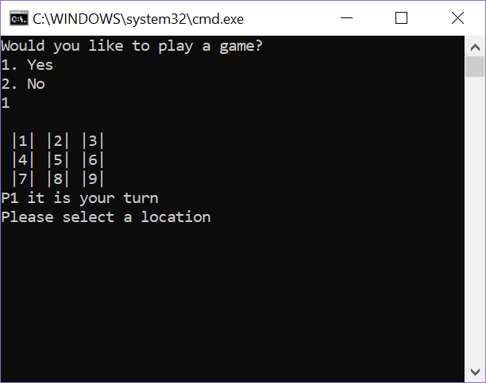
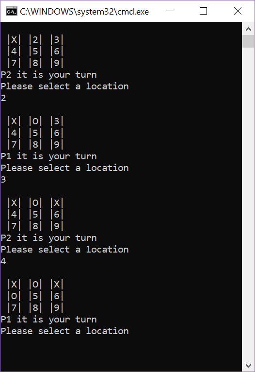
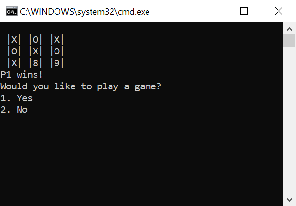
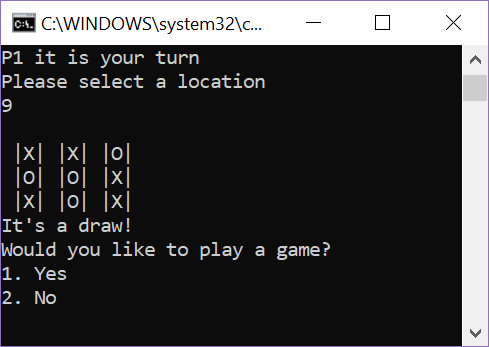

# Lab04_TicTacToe

## Description
A fun tic tac toe game. Enter a number corresponding to which block you want to select, and away you go!

## Instructions
- Run program
- Enter 1 to begin the game
- Player one is X, player two is O.
- It's now Player One's turn! Enter a number 1-9, to select your square.
	- Note, the actual number "1" needs to be input, NOT "one"
- Player One's choice will be recorded, it is not player two's turn to select a square.
	- Player Two must select a NEW square, the game will not let you select a square that has already been selected.
- Continue the game till there is a winner, or the board is full. The game will alert you to either option. 
- Select 1 to play again, and 2 to close.

## Visual

### Menu

### Sample Game Play

### Winning Screen 

### Draw Screen

